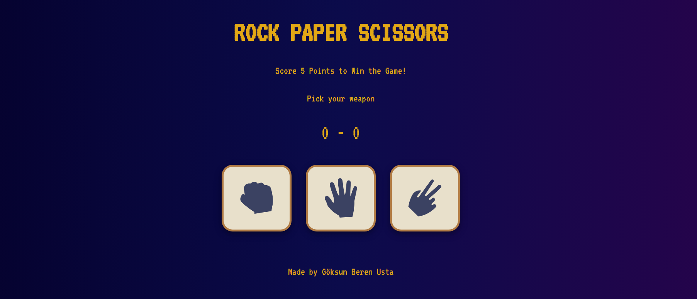
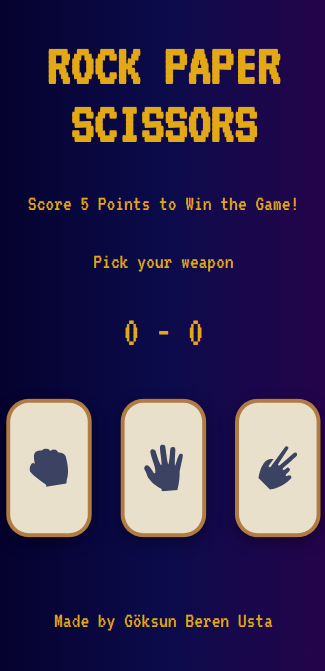

# Rock Paper Scissors Game
A simple UI for Rock Paper Scissors game made with HTML, CSS and JavaScript.

Live demo: https://goksunberen.github.io/rock-paper-scissors/index.html

The game includes sound effects for win, lose and tie situations. 

The audios are taken from:
- Sound Effect from <a href="https://pixabay.com/sound-effects/?utm_source=link-attribution&utm_medium=referral&utm_campaign=music&utm_content=6297">Pixabay</a>
- Sound Effect by <a href="https://pixabay.com/users/audiosto-40753689/?utm_source=link-attribution&utm_medium=referral&utm_campaign=music&utm_content=179699">Audiosto</a> from <a href="https://pixabay.com//?utm_source=link-attribution&utm_medium=referral&utm_campaign=music&utm_content=179699">Pixabay</a>

- Sound Effect by <a href="https://pixabay.com/users/universfield-28281460/?utm_source=link-attribution&utm_medium=referral&utm_campaign=music&utm_content=126514">Creating Background Music and Effects</a> from <a href="https://pixabay.com/sound-effects//?utm_source=link-attribution&utm_medium=referral&utm_campaign=music&utm_content=126514">Pixabay</a>

The images for rock, paper and scissors are taken from [Frontend Mentor](https://www.frontendmentor.io/).
### Desktop Version

### Mobile Version

